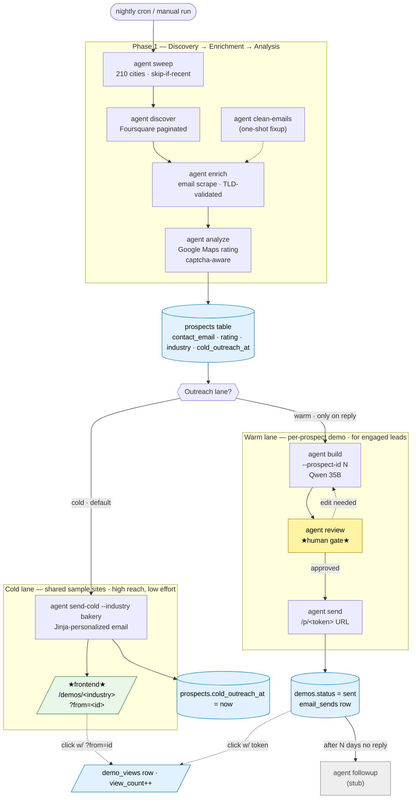

# Sudco Agent

The autonomous prospecting agent for **Sudco Solutions**.

The agent finds small businesses online, generates a custom demo website for each one using the local Qwen LLM, queues each demo for human approval, and emails the prospect a private link to their preview. Today: human-in-the-loop on approval and send. Goal: fully autonomous with humans only watching dashboards.

It is a separate project from `SudcoSolutions/` (the website) — different language, different deploy lifecycle, different secrets — but it writes prospect demos into that website's API.

---

## Pipeline



★ Two human-touch points: per-industry **static demos** (built once on the frontend, hosted at `/demos/<industry>`) and the **review gate** for warm-lead per-prospect demos. As confidence grows, certain prospect classes can auto-approve through the warm gate.

---

## What each command does

| Command | What it does | Talks to |
|---|---|---|
| `agent health` | Sanity-checks API + LLM + SMTP reachability | API, llama.cpp, SMTP |
| `agent sweep --query bakery` | Iterates `discover` across the top N cities (US, TX, Houston metro, or all three deduped). Default: all 210 unique cities, 5,000 prospects/city, 7-day skip-if-recent. Use `--query-pack <name>` to loop over an entire vertical at once (see `sudco_agent/data/queries.json`). Records every run in `discovery_searches`. | Foursquare → API |
| `agent discover --area "Pasco, WA"` | Finds places via Foursquare, paginates automatically (50/page), upserts as prospects. Skips chains by default (`--include-chains` to override). `--only-without-website` is a stronger filter for sales-readiness. | Foursquare → API |
| `agent enrich` | For prospects without a contact email: fetches their existing website + `/contact` `/about` pages, scrapes `mailto:` links and visible email patterns, deobfuscates "info [at] example [dot] com" tricks. Writes results back via PATCH. | website HTTP, API |
| `agent analyze` | Scrapes Google Maps for rating + review count using **4 parallel Playwright pages**. Captcha-protected: auto-aborts after 3 captcha hits with clear retry instructions. Skips prospects already rated. | Playwright → Google Maps, API |
| `agent build --prospect-id 42` | Generates the full demo data (copy, palette, services, hours) using Qwen text model + Pexels images, stores at `pending_review` | Qwen 35B, Pexels, API |
| `agent build --all-pending --min-rating 4.0` | Same, for every prospect with rating ≥ 4.0 that doesn't have a demo yet. Skips chains and unrated prospects. | (same) |
| `agent review` | **Human approval TUI.** Shows each pending demo with a clickable browser preview. You approve / decline / skip / delete | API |
| `agent send` | **Warm path.** Emails the per-prospect demo URL (`/p/<token>`) for every prospect with `status=approved`. Reserved for replies / interested leads — used after a manual `agent build --prospect-id <id>`. Marks them `sent` | SMTP, API |
| `agent send-cold --industry bakery` | **Cold path — first touch only.** Blasts a *shared* per-industry sample-site URL (`{COLD_DEMO_BASE_URL}/<industry>?from=<id>`) to prospects who have **never** been cold-emailed (`cold_outreach_at is null`). After sending, sets `cold_outreach_at`; handed off to `agent followup-cold` and never re-blasted. Email body is Jinja-personalized + has a reputation-framed text-LLM observation tying site content to Google reviews (rating-tier-aware). Pitches 4 service tiers: site refresh ($800), GBP+SEO ($300-500), review-funnel automation ($200/mo), reputation monitoring ($150/mo). Filters: `--min-rating`, `--require-no-website`, `--limit`, `--dry-run`. Confirmation prompt unless `--yes`. | SMTP, API, Qwen text |
| `agent followup-cold --industry bakery` | **Cold follow-up.** Sends a follow-up email to prospects who got the cold email at least N days ago (default 7) and don't have `cold_followup_at` or `cold_replied_at` set. After sending, sets `cold_followup_at` so they're never followed up again from this command. Filters mirror `send-cold`. | SMTP, API |
| `agent process-bounces --commit` | **Inbound IMAP scan**, single session, two parallel paths: (1) MAILER-DAEMON bounce notifications → mark prospects `bounced_at` + null `contact_email`; (2) inbound unsubscribe replies (subject `UNSUBSCRIBE-<prospect_id>` from the List-Unsubscribe header) → mark prospects `unsubscribed_at`. Default mode is dry-run. Add `--commit-imap` to also \\Deleted+EXPUNGE the processed messages. | IMAP, API |
| `agent clean-emails --commit` | One-shot revalidate every prospect's `contact_email` against the same regex/junk filters as `enrich`, null out invalid ones. Useful after scraper changes. | API |
| `agent followup` *(stub)* | Sends follow-up to no-replies past `FOLLOWUP_AFTER_DAYS` | SMTP, API |
| `agent delete-prospect --id 42` | Hard-delete a prospect (and any associated demos via CASCADE). Confirmation prompt unless `--yes`. | API |

All state — prospects, demos, view counts, email sends — lives in the **SudcoSolutions backend's SQLite DB**. The agent itself is stateless: it talks to the admin API for everything. This means rerunning a command is safe; the API enforces dedupe (`UNIQUE(source, source_id)` on prospects) and uniqueness (token).

---

## The human approval gate

`agent review` is the most important command in the pipeline today. It pulls every demo with `status=pending_review` and walks you through them one at a time.

For each demo:

```
─────────── 3/12 — Bella's Bakery ───────────
┌─ Prospect ──────────────────────┐
│ Business     Bella's Bakery     │
│ Industry     Bakery             │
│ Location     Cedar Falls, IA    │
│ Email        hello@bellas.com   │
│ Token        bak-bellas-…       │
│ Created      2026-04-29T19:11   │
└─────────────────────────────────┘
┌─ Generated demo ────────────────┐
│ ### Bella's Bakery              │
│ _Fresh sourdough …_             │
│ **Services**                    │
│ - Bread — daily.                │
│ - Custom Cakes — 48hr lead.     │
│ ...                             │
└─────────────────────────────────┘

Open in browser: https://sudcosolutions.com/p/bak-bellas-…

Action: [a] approve  [d] decline  [s] skip  [o] open in browser
        [j] dump full JSON  [x] hard delete  [q] quit
```

- **`a` Approve** — `status=approved`. The demo is ready to send.
- **`d` Decline** — `status=declined`. Won't be emailed. Useful when the LLM produced something bad and you don't want to retry.
- **`s` Skip** — leaves the status as `pending_review`. Comes back next time.
- **`o` Open in browser** — pops the live `/p/<token>` URL so you can see the actual rendered demo, not just the data.
- **`j` Dump JSON** — prints the raw demo data for inspection.
- **`x` Delete** — removes the demo entirely (asks for `DELETE` confirmation). Useful for genuinely bad output.
- **`q` Quit** — stop reviewing; everything you've already actioned is saved.

You can run `agent review` any time — it picks up wherever you left off.

---

## Setup

You need:
- `uv` (Astral's Python package manager — install per https://docs.astral.sh/uv/)
- Python 3.11+ — the install pins to 3.12 via `uv venv --python 3.12`
- A local OpenAI-compatible LLM endpoint (the agent expects llama.cpp / vLLM serving Qwen at `127.0.0.1:8011` by default; configurable via `LLM_BASE_URL`)
- A reachable [SudcoSolutions](https://github.com/) backend (the agent talks to it for state — see the companion repo)
- A Foursquare **Service API Key** (free tier, https://foursquare.com/developers/) — note: legacy `fsq3...` keys do not work against the new `places-api.foursquare.com` host. You need a Service Key from the new console.
- A Pexels API key (free, https://www.pexels.com/api/)

```bash
make install           # uv-managed venv, installs deps + Playwright Chromium
cp .env.example .env   # then fill in keys (see below)
make health            # sanity-check everything reachable
```

The `agent` script is installed into `.venv/bin/agent` once `uv pip install -e .` finishes.

---

## Configuration (`.env`)

| Variable | What it's for |
|---|---|
| `SUDCO_API_BASE` | Where to call the admin API. Default: `https://sudcosolutions.com/api` |
| `SUDCO_ADMIN_API_KEY` | Bearer token for admin endpoints. Lives in `SudcoSolutions/server/.env` — copy that value here. |
| `LLM_BASE_URL` | Default `http://127.0.0.1:8011/v1` (your llama.cpp router) |
| `LLM_TEXT_MODEL` | Default `qwen3.6-35b-a3b` — used for copy + palette + services |
| `LLM_VISION_MODEL` | Default `qwen3-vl-30b-a3b-instruct` — used by `analyze` for site judging |
| `FOURSQUARE_API_KEY` | Free tier, 1k calls/day. Sign up at https://foursquare.com/developers/ |
| `PEXELS_API_KEY` | Free, generous limits. Sign up at https://www.pexels.com/api/ |
| `SMTP_HOST` / `SMTP_PORT` / `SMTP_USER` / `SMTP_PASS` | Same docker-mailserver as the website. **Use `mail.sudcosolutions.com`, not `localhost`** — the TLS cert is valid for the public hostname only. Port `587` STARTTLS. |
| `IMAP_HOST` / `IMAP_PORT` / `IMAP_SENT_FOLDER` | Used to save outbound copies to your Sent folder (defaults to SMTP_HOST + 993 + `Sent`). Empty `IMAP_HOST` disables Sent saving. |
| `MAIL_FROM` | What goes in the `From:` header. Default: `Nate at Sudco Solutions <nate@sudcosolutions.com>` |
| `COLD_DEMO_BASE_URL` | Base URL for the per-industry sample sites linked in cold emails. Default: `https://sudcosolutions.com/demos`. Linked as `<base>/<industry>?from=<prospect_id>`. |
| `DEMO_EXPIRES_DAYS` | How long a prospect demo URL stays live. Default 30. |
| `FOLLOWUP_AFTER_DAYS` | When to send the warm-path follow-up email. Default 7. |
| `DRY_RUN` | If `true`, `agent send` / `send-cold` log what they would send instead of sending |

---

## Common workflows

### First-time end-to-end smoke test
```bash
make health                                                # everything reachable?
agent discover --area "Pasco, WA" --query bakery --limit 3 # 3 prospects in Pasco
agent build --all-pending                                  # generate demos for them
agent review                                               # approve one
DRY_RUN=true agent send                                    # see what would send (no real email)
agent send                                                 # actually send the approved one
```

### Routine batch run (single area)
```bash
agent discover --area "Boise, ID" --query bakery
agent enrich                                   # fill missing emails by crawling websites
agent analyze                                  # Google Maps rating + review count (parallel)
agent build --all-pending --min-rating 4.0     # demos for prospects ≥ 4.0 stars
agent review                                   # ~15s per demo to glance at
agent send                                     # only approved ones go out
```

### Wide-area sweep (multi-city, overnight-friendly)
```bash
agent sweep --query bakery                     # all 210 cities, 5,000/city max
agent enrich
agent analyze --concurrency 4                  # parallel Playwright; ~0.85s per prospect
agent build --all-pending --min-rating 4.0
agent review
agent send
```

**Or use the included overnight driver script** (logs to `data/logs/`):
```bash
tmux new-session -d -s sudco-overnight \
  -c ~/code/dev/sudco-agent './scripts/overnight-run.sh'
tmux attach -t sudco-overnight                 # to watch live; Ctrl-b d to detach
```

### Sweep an entire vertical (`--query-pack`)
The query strings live in [`sudco_agent/data/queries.json`](sudco_agent/data/queries.json), grouped into packs (`food`, `beauty`, `personal_services`, `trades`, `specialty_retail`, `health`). Edit that file freely — new queries and new packs are picked up automatically.

```bash
# Loop every query in the "beauty" pack across the Houston metro
agent sweep --query-pack beauty --region hou

# Loop every query in every pack across all 210 cities (this is a lot of API calls)
agent sweep --query-pack all
```

**Available packs** — list them programmatically:
```python
from sudco_agent.data.queries import pack_names, pack, all_queries

pack_names()           # ['food', 'beauty', 'personal_services', 'trades', 'specialty_retail', 'health']
pack("food")           # ['bakery', 'cafe', 'coffee shop', ...]
all_queries()          # flat deduped list of every query in every pack
```

`--query` and `--query-pack` are mutually exclusive. The sweep's `discovery_searches` skip-if-recent table de-dupes across queries, so re-running an overlapping pack is cheap.

### Cold-blast workflow (shared sample sites — high reach, low effort)

The "warm" pipeline (`build → review → send`) generates a unique demo per prospect. That's high effort. For broad cold outreach, prefer the **cold path** instead:

1. **One polished sample site per industry on the frontend** — e.g. a static React route at `https://sudcosolutions.com/demos/bakery`. One demo, many prospects. Polish it once and forget.
2. **Reputation-framed email-side personalization** — `agent send-cold` injects business name + location into the email body via Jinja, **plus a text-LLM observation that ties the prospect's site content to their Google reviews** (e.g. *"I noticed your 4.8★ across 124 reviews — customers keep mentioning the welcoming staff, and that warmth comes through on your homepage too"*). The LLM uses rating-tier guidance so high-rated prospects get an "amplify what's working" framing while low-rated prospects get a softer "let's surface your strengths" angle — never shaming. Each link includes `?from=<prospect_id>` for click tracking. Branded HTML email with 4 service tiers + gradient "S" logo + plaintext fallback.
3. **Reply-driven personalization** — when a prospect actually replies "interested", you run `agent build --prospect-id <id>` → `agent review` → `agent send` to deliver a custom demo with a unique `/p/<token>` URL. Tokens are reserved for engaged leads.

**Configure once** in `.env`:
```bash
COLD_DEMO_BASE_URL=https://sudcosolutions.com/demos
SMTP_HOST=mail.sudcosolutions.com    # NOT 'localhost' — TLS cert must verify
IMAP_HOST=mail.sudcosolutions.com    # so sent copies land in your Sent folder
```

**Typical cold blast** (all Houston-metro bakeries — no rating floor; the recurring services help low-rated prospects most):
```bash
# Preview first — dry-run shows the table of recipients + the URL pattern
agent send-cold --industry bakery --limit 50 --dry-run

# When the preview looks right, do it for real (will prompt for confirmation)
agent send-cold --industry bakery --limit 50

# Skip the prompt with --yes once you trust the filter:
agent send-cold --industry bakery --yes

# Skip the per-prospect text-LLM observation (faster but loses personalization):
agent send-cold --industry bakery --no-site-review
```

`--min-rating` is still available as a filter knob, but isn't applied by default. The cron line below also runs with no rating floor — low-rated prospects get a softer LLM framing and a more compelling pitch (review-funnel automation + reputation monitoring), so excluding them would be leaving the lowest-hanging fruit on the tree.

`agent send-cold` is **strict first-touch only**: any prospect whose `cold_outreach_at` is set (whenever) gets skipped here and is handled by `agent followup-cold` instead. So:

```
Day 0:   agent send-cold --industry bakery       # first email; sets cold_outreach_at
Day 7+:  agent followup-cold --industry bakery   # follow-up; sets cold_followup_at
        # no further automatic emails — manually mark cold_replied_at on responders
```

The `site_observation` is **cached on the prospect** (90-day TTL) so re-runs and `followup-cold` skip the LLM cost. The observation is generated by feeding the site HTML + cached `review_excerpts` (top-5 Google reviews scraped during `agent analyze`) + rating-tier guidance into Qwen 3.6 35B with thinking suppressed.

If you ever need to re-blast a prospect (e.g., after a major email-copy change), manually clear `cold_outreach_at` on them via the admin API. The agent has no built-in "force re-blast" knob — that's intentional, to avoid accidental double-blasts.

> **Frontend prerequisite:** for the link in the cold email to lead anywhere useful, your React app needs a route at `/demos/<industry>` for each industry you blast. The agent doesn't build the static demo — that's content work on the sudcosolutions.com side. The `?from=<id>` param is what lets the frontend log clicks back via `POST /api/showcase_views`.

> **Backend prerequisite:** the SudcoSolutions admin API has a strict `PATCHABLE_FIELDS` allowlist in `server/db/index.js`. The cold-outreach lifecycle fields (`cold_outreach_at`, `cold_followup_at`, `cold_replied_at`, `site_observation`, `site_observation_at`, `review_excerpts`, `bounced_at`, `unsubscribed_at`) must be allowlisted *and* added as `ensureColumn` migrations before the agent can persist them. The agent warns loudly if a field gets silently dropped — watch logs for `"silently dropped"`.

### Paced cold-blast via cron (recommended for scale)

For new senders, blasting hundreds of cold emails in one day risks deliverability. Pace via a user crontab (no sudo):

```bash
crontab -e
```

```cron
# Cold-blast pacer: 10 prospects every 10 min (small bursts, smooth pacing),
# Mon–Sat 9 AM – 4 PM local. 10 × 6 ticks/hour × 8 hours × 6 days = 2,880/week.
*/10 9-16 * * 1-6 flock -n /tmp/sudco-cold.lock /home/nate/code/dev/sudco-agent/.venv/bin/agent --log-file "/home/nate/code/dev/sudco-agent/data/logs/send-cold-$(date +\%Y\%m\%d-\%H\%M).log" send-cold --limit 10 --yes

# Bounce + unsubscribe cleanup: every 30 min at :05 and :35 (between send ticks)
# so dead addresses and opt-outs get pruned within ~30 min of being received.
5,35 9-16 * * 1-6 flock -n /tmp/sudco-bounces.lock /home/nate/code/dev/sudco-agent/.venv/bin/agent --log-file "/home/nate/code/dev/sudco-agent/data/logs/process-bounces-$(date +\%Y\%m\%d).log" process-bounces --commit --commit-imap --yes
```

Things baked in:

- **Absolute paths** — cron's default cwd is the user's home, not the project root
- **`flock -n /tmp/sudco-cold.lock`** — prevents overlap if a run somehow takes >10 min (silently no-ops the next tick rather than double-blasting). The bounce job uses a separate lock file so the two can run concurrently if their schedules collide
- **`\%`** — cron treats `%` as newline-in-command, so `date +%Y…` is escaped as `\%Y…`
- **`* * 1-6`** — Mon-Sat. Sunday is intentionally excluded — small biz owners are typically not in their inbox Sunday and the perception risk outweighs the volume gain. Use `* * 1-5` for weekdays only or `* * *` for 7-day pacing
- **No `--industry` filter on the line** — runs in all-industries mode, matching every prospect against `sudco_agent/data/industry_demos.json`. Add `--industry <slug>` to scope to one demo's keyword set
- **No `--min-rating` floor** — low-rated prospects are intentionally included; the recurring services (review-funnel automation, reputation monitoring) help them most, and `site_review`'s tiered LLM framing handles them with empathy
- **Per-run log file** — `data/logs/send-cold-YYYYMMDD-HHMM.log` for easy post-mortem

Pause/resume:
```bash
# pause cold-blast
crontab -l | sed 's|^\*/10 9-16|#*/10 9-16|' | crontab -

# resume cold-blast
crontab -l | sed 's|^#\*/10 9-16|*/10 9-16|' | crontab -

# pause bounce job
crontab -l | sed 's|^5,35 9-16|#5,35 9-16|' | crontab -
```

### Follow-up workflow

After cold-blasted prospects have had time to reply, `agent followup-cold` sweeps the same pool with a follow-up email:

```bash
# Preview
agent followup-cold --industry bakery --dry-run

# Send (default: only follow up if cold email was at least 7 days ago)
agent followup-cold --industry bakery --yes

# Earlier window
agent followup-cold --industry bakery --days-since-outreach 5
```

Filters:

- `cold_outreach_at` set ≥ N days ago (`--days-since-outreach`, default 7)
- `cold_followup_at` is null (no double-followup)
- `cold_replied_at` is null (manually mark responders to exclude them)
- Same `--industry`, `--min-rating`, `--limit`, `--dry-run`, `--yes` semantics as `send-cold`

Reply tracking is **manual today** — no IMAP-based reply auto-detection. To exclude a prospect who replied, PATCH `cold_replied_at` on them via the admin API, or null their `cold_followup_at` to keep them out of follow-up runs.

### Throughput rules of thumb
- **Sweep**: ~3 sec per city + Foursquare pagination = roughly 15–25 min for the full 210-city default
- **Analyze (parallel, concurrency=4)**: ~0.85 sec per prospect end-to-end. 1,000 prospects ≈ 14 min, 10,000 ≈ 2.5 hours
- **Enrich (parallel, concurrency=4)**: ~3–8 sec per prospect on real fetches; skips fly past at ~30/sec. 730 fresh prospects in ~9 min from a recent run.
- **Build (warm path)**: dominated by Qwen 35B inference time; ~10–30 sec per demo on the local llama.cpp setup
- **Send-cold**: ~10–20 sec per prospect (HTML fetch + text-LLM observation + SMTP + IMAP append + API patch). 25 prospects/hour is the recommended cron pace. Faster than the prior vision-LLM path because there's no screenshot + no model-swap on llama.cpp.
- **Followup-cold**: ~2 sec per prospect (no fresh LLM call — uses cached `site_observation`)

### Inspect a specific demo from the command line
```bash
curl -s https://sudcosolutions.com/api/admin/demos?status=pending_review \
  -H "Authorization: Bearer $SUDCO_ADMIN_API_KEY" | jq
```

### Hard reset (rebuild a demo for a prospect)
```bash
# 1. delete the existing demo for that prospect via the admin API
# 2. agent build --prospect-id <id> regenerates fresh
```

---

## File layout

```
sudco-agent/
├── pyproject.toml         project + entry point
├── Makefile               install / dev / common commands
├── .env.example
├── prompts/
│   └── generate_demo.txt  the LLM prompt for demo content
├── scripts/
│   ├── overnight-run.sh   tmux-friendly sweep + analyze driver
│   └── fetch-images.sh    one-off image cache (legacy)
├── sudco_agent/
│   ├── __main__.py        argparse CLI dispatcher (rich logging + progress)
│   ├── config.py          env loading
│   ├── llm.py             OpenAI-compatible client → llama.cpp router
│   ├── api_client.py      HTTP client for SudcoSolutions admin API
│   ├── data/
│   │   ├── top_us_cities.py  100 US + 100 TX + 37 Houston-metro cities, deduped accessor
│   │   ├── queries.json      curated query packs (food/beauty/trades/...) for `agent sweep`
│   │   └── queries.py        loader — pack(), pack_names(), all_queries()
│   ├── discovery/
│   │   └── foursquare.py     auto-paginating Places API client
│   ├── analysis/
│   │   └── gmaps.py          Google Maps scraper + captcha detector
│   ├── enrichment/
│   │   ├── email_scraper.py  mailto + bracketed-obfuscation email crawler (TLD-validated, MX-filtered)
│   │   └── site_review.py    reputation-framed per-prospect observation (site HTML + reviews → text LLM)
│   ├── generation/
│   │   ├── content.py     Qwen → demo data JSON (warm path)
│   │   └── images.py      Pexels → cover + gallery URLs
│   ├── review/
│   │   └── tui.py         rich-based approval UI (warm path)
│   ├── outreach/
│   │   ├── email.py       SMTP send + IMAP Sent append + multipart text/HTML + List-Unsubscribe header
│   │   └── templates/
│   │       ├── first_outreach.txt        (warm — per-prospect /p/<token>)
│   │       ├── follow_up_1.txt           (warm follow-up)
│   │       ├── first_outreach_cold.txt   (cold — plaintext fallback)
│   │       ├── first_outreach_cold.html  (cold — branded HTML w/ gradient logo)
│   │       ├── follow_up_cold.txt        (cold follow-up — plaintext)
│   │       └── follow_up_cold.html       (cold follow-up — branded HTML)
│   └── commands/          one file per CLI subcommand:
│                          discover, sweep, enrich, analyze, build, review,
│                          send (warm), send_cold, followup, followup_cold,
│                          process_bounces, clean_emails, health, delete-prospect
└── tests/                 pytest, 63 unit tests covering parsers + regex regressions
```

---

## Operational notes

### Captcha resilience (analyze)
`agent analyze` parses Google Maps responses for known captcha markers — redirects to `google.com/sorry`, "unusual traffic" titles, "i'm not a robot" body text. On every captcha hit the agent **backs off** instead of aborting:

1. Halve `concurrency` (floor 1)
2. Double `delay` (ceiling 30s)
3. Cool down for 60 seconds before resuming
4. Continue with the reduced rate

Only when we've already throttled all the way to `concurrency=1, delay=30s` and *still* hit captchas does the run abort with code 2 — at that point the IP is genuinely blocked and continuing wastes cycles.

Other anti-detection measures the run uses by default:
- **Per-fetch BrowserContext** — fresh cookies and fingerprint per request, so one flagged fetch doesn't fate-share with the others in flight.
- **User-agent rotation** — five modern Chromium UAs across Linux/Mac/Windows, picked at random per request.
- **Jittered delay** — actual delay is `base × random(0.6, 1.4)` per request, breaking the rigid every-1.5s pattern.
- **Staggered worker startup** — each worker waits a random 0–`delay` seconds before its first fire, so the initial burst isn't simultaneous.

### `rating_lookup_status` — don't redo work
Each lookup PATCHes a `rating_lookup_status` and `last_rating_attempt` back to the prospect record. Future analyze runs use this to skip prospects we already know about:

| Last status | Skip window |
|---|---|
| `found` (rating present) | always |
| `not_found` (page loaded, no rating element) | 30 days |
| `timeout` | 24 hours |
| `error` | 7 days |
| `captcha` | 4 hours |

So a re-run after a captcha-driven cooldown only retries the prospects that were genuinely captcha'd, not every dead listing in the DB. Pass `--force` to ignore the skip windows.

### Foursquare quotas (real numbers)
Per `x-ratelimit-*` response headers from the new Places API:
- **Quota**: 180,000 calls / window (very generous — far above the documented "1k/day" tier)
- **Burst**: 150 concurrent requests
- **Per-call max**: 50 results (we auto-paginate via `Link: rel="next"` header)

A 210-city sweep with `--limit-per-city 5000` is at most ~21,000 calls — comfortably under quota for a single query. **Watch out with `--query-pack all`**: that's the per-query budget × ~70 queries, so split it across days or use `--query-pack <one_pack>` at a time.

### Skipping repeated work
- **Sweep / discover**: each run gets a row in `discovery_searches` (area + query + timestamp). `--skip-if-recent-days N` (default 7) bypasses already-searched (area, query) pairs.
- **Analyze**: skips prospects with `rating IS NOT NULL` unless `--force`.
- **Enrich**: skips prospects with `contact_email` already set, OR enriched within `--max-age-days` (default 30) unless `--force`.
- **Build (warm path)**: skips prospects that already have a demo.
- **Send-cold**: **strict first-touch only** — skips any prospect with `cold_outreach_at`, `bounced_at`, or `unsubscribed_at` set. Also skips prospects who haven't been seen by `analyze` yet (rating null AND last_rating_attempt null) — without that gate, fresh sweeps get emailed before reviews are scraped, locking in a weaker site-only `site_observation` for 90 days. Re-blasts require manually nulling `cold_outreach_at` via the admin API.
- **Followup-cold**: skips prospects with `cold_followup_at`, `cold_replied_at`, `bounced_at`, or `unsubscribed_at` set, or `cold_outreach_at` younger than `--days-since-outreach` (default 7).
- **Enrich**: MX-filters discovered emails. Each candidate's domain is checked for MX records (or A/AAAA fallback per RFC 5321 §5.1). NXDOMAIN or "no records at all" → email is moved to `enrichment.mx_rejected` and `best_email()` skips it. Transient DNS errors (or a missing dnspython) are treated as "uncertain — keep" so we don't lose addresses to flaky lookups. First-line defense against hard bounces; second line is `process-bounces`.
- **Site review (text LLM, reputation-framed)**: cached on the prospect as `site_observation` + `site_observation_at` with 90-day TTL. Re-runs and `followup-cold` reuse the cache. Inputs: site HTML + `review_excerpts` (top-5 Google reviews scraped during `agent analyze`) + rating-tier guidance.
- **Review excerpts**: `agent analyze` scrapes the top-5 Google reviews per prospect and stores them as JSON on `review_excerpts`. Best-effort — if the place page lookup fails (ambiguous match, no reviews on the panel, layout drift), the field stays empty and `site_review` falls back to site-HTML-only framing.
- **Foursquare upserts** dedupe on `(source, source_id)` so re-discovery never creates duplicates.

### Progress bars + logs
Every long-running command (`sweep`, `analyze`, `enrich`, `send-cold`, `followup-cold`, `clean-emails`) renders a live `rich` progress bar with rolling stats (sent / w-obs / err counts, ETA). Logs render via `RichHandler` so error/warning lines print *above* the bar without clobbering it. httpx's per-request INFO logs are silenced by default — pass `-v` to re-enable for debugging.

Use `agent --log-file PATH ...` to also write a plain log file alongside the live bar (cleaner than `| tee` since it doesn't kill Rich's TTY rendering).

### Logs directory
The `scripts/overnight-run.sh` helper writes per-phase logs to `data/logs/sweep-<TS>.log` and `data/logs/analyze-<TS>.log` so a finished overnight run leaves auditable history.

---

## Deliverability

Cold outreach lives or dies on inbox-vs-spam placement. The agent's design accounts for this; key components, in roughly the order they matter:

### Mail authentication (one-time DNS setup, but easy to break)

Three records on the sending domain. **All three need to pass** for receivers to accept the message into the inbox at scale:

- **SPF** (`@` TXT): `v=spf1 mx ~all` — declares the MX-listed servers as authorized senders.
- **DKIM** (`mail._domainkey` TXT): the public RSA key from `/tmp/docker-mailserver/rspamd/dkim/rsa-2048-mail-<domain>.public.dns.txt` inside the mailserver. **Must be the full ~410-char key** — some DNS UIs (notably GoDaddy's) silently truncate at the first `;`. If your registrar's UI mangles the record, use their API to PUT it directly. Verify what the world actually sees with DNS-over-HTTPS:
  ```bash
  curl -s "https://1.1.1.1/dns-query?name=mail._domainkey.sudcosolutions.com&type=TXT" \
    -H "accept: application/dns-json" | jq '.Answer[0].data | length'
  # expect ~415; if you see 10, the record is truncated
  ```
- **DMARC** (`_dmarc` TXT): `v=DMARC1; p=quarantine; rua=mailto:...` — quarantine is the right default for a young domain.

Plus **forward-confirmed reverse DNS (FCrDNS)**: your sending IP's PTR must resolve forward back to the same IP. Receivers use this as an anti-spam signal; failing it gets you connection-dropped at Cloudflare/Outlook edges.

### Per-message hygiene (handled automatically by the agent)

- **List-Unsubscribe header** — every cold and follow-up adds `List-Unsubscribe: <mailto:nate@sudcosolutions.com?subject=UNSUBSCRIBE-{prospect_id}>`. Gmail/Outlook surface this as a one-click unsubscribe button. Recipient replies land in your inbox with the prospect_id-tagged subject; `agent process-bounces` parses the id and marks `unsubscribed_at`.
- **Don't sign List-Unsubscribe with DKIM.** Downstream relays (amavis, plus some receivers) normalize the URI value, which breaks the signature. If you're using docker-mailserver with rspamd, drop an explicit `sign_headers` override at `/tmp/docker-mailserver/rspamd/override.d/dkim_signing.conf` excluding `list-*`:
  ```conf
  sign_headers = "(o)from:(o)sender:(o)reply-to:(o)subject:(o)date:(o)message-id:(o)to:(o)cc:(o)mime-version:(o)content-type:(o)content-transfer-encoding:(o)in-reply-to:(o)references";
  ```
  Without that override, every send with the List-Unsubscribe header fails DKIM validation. Restart rspamd after the edit.
- **MX filter on enrich** — see "Skipping repeated work" above. Drops candidate emails whose domain has no MX/A records before they ever get sent. First line of defense.
- **Bounce + unsubscribe processing** — `agent process-bounces` runs every 30 min via cron, marks dead/opted-out prospects so they're skipped on subsequent sends. Second line of defense.

### Verifying it all works

[mail-tester.com](https://www.mail-tester.com) is the gold-standard one-off check: send a single cold-style email to the address they give you, click "Check your score." Target 9+/10 with all of SPF / DKIM / DMARC showing pass. Expect ~10 minutes of DNS edits + verification to get there from a fresh sender. Common deductions:

| Deduction | What it means |
|---|---|
| `DKIM_INVALID` | Record published wrong, OR a relay modifies a signed header (see List-Unsubscribe note) |
| `SPF_HELO_NONE` | HELO hostname has no SPF — minor, ~-0.001 |
| `MISSING_LIST_UNSUBSCRIBE` | Self-explanatory; the agent handles this |

Beyond mail-tester, set up [Gmail Postmaster Tools](https://postmaster.google.com) once you're sending hundreds/day to Gmail addresses — it's the only way to see Gmail's actual reputation view of you.

---

## Roadmap to full automation

In rough priority:

1. **Vision-judge step in `analyze`** — Playwright screenshot of the prospect's existing site, Qwen-VL scores quality 1–10. Mark prospects as ready-to-build only when rating ≥ 4.5 AND (no website OR vision score < 5).
2. **Auto-approve heuristics** — if Qwen output passes structural validation (palette contrast, specific service copy, location match), skip `pending_review` and go straight to `approved`. Human review becomes a sampling check.
3. **Reply detection** — IMAP poll of the inbox, mark prospects with `cold_replied_at` when they respond. Currently manual via PATCH. (Bounces + unsubscribes are already auto-detected via `process-bounces`.)
4. **HTTPS one-click unsubscribe (RFC 8058)** — the current List-Unsubscribe is mailto-only. Add an `https://` URI variant + `List-Unsubscribe-Post: List-Unsubscribe=One-Click` header, plus a backend route that handles the POST. Required by Gmail/Yahoo for senders >5K/day.
5. **Sweep scheduler** — systemd timer running `agent sweep` weekly for fresh prospects (today it's manual + overnight-run.sh).
6. **Admin dashboard** — admin UI on `sudcosolutions.com/admin` showing send rate, click rate, bounce/unsub rates, per-industry breakdown, recent-events feed. Currently it's all in SQLite reachable via `curl` + `jq`.
7. **Self-host prospect images** — download Pexels URLs into `/var/www/html/images/prospects/<token>/` so demos don't depend on an external CDN.

---

## Cost summary

| Component | Cost |
|---|---|
| Qwen text + vision generation | $0 (local llama.cpp) |
| Foursquare Places API | $0 (free tier — 180k calls/window per response headers) |
| Pexels image API | $0 (free) |
| Google Maps scraping (analyze) | $0 (Playwright + headless Chromium, your IP) |
| Outbound email | $0 (your docker-mailserver) |
| Sudco backend (already running) | $0 (already part of the site infra) |
| **Total** | **$0/month** |

The agent's only ongoing cost is electricity for inference and the residential IP / network bandwidth for Playwright. If Google's anti-scraping ever ramps up enough that captchas become routine, residential proxies become necessary — but at solo-prospector volume we're nowhere near that threshold.
